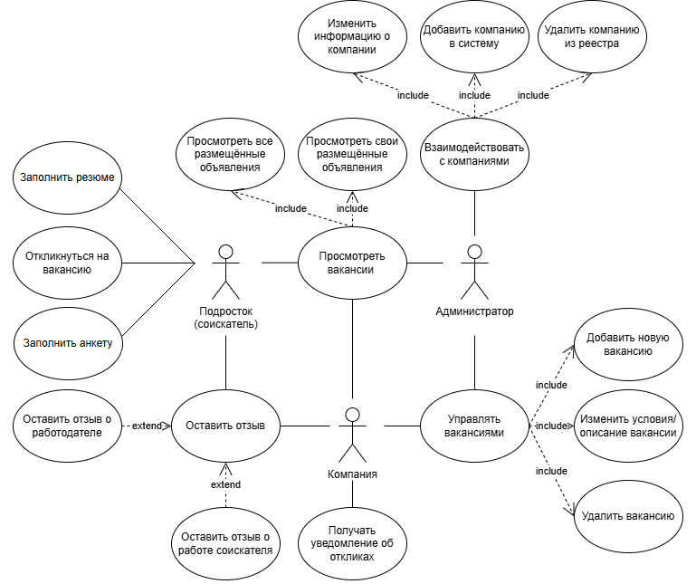
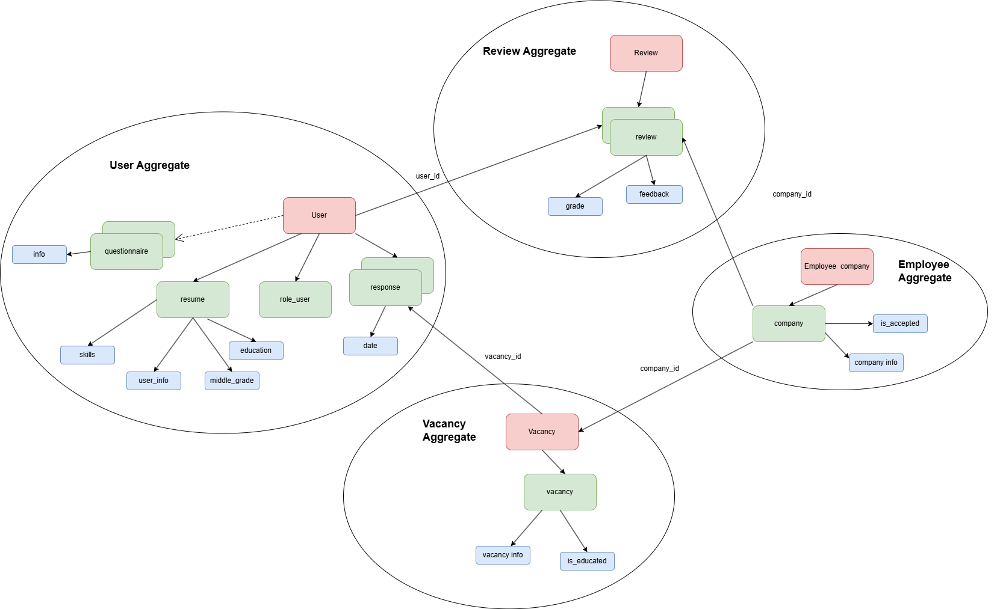
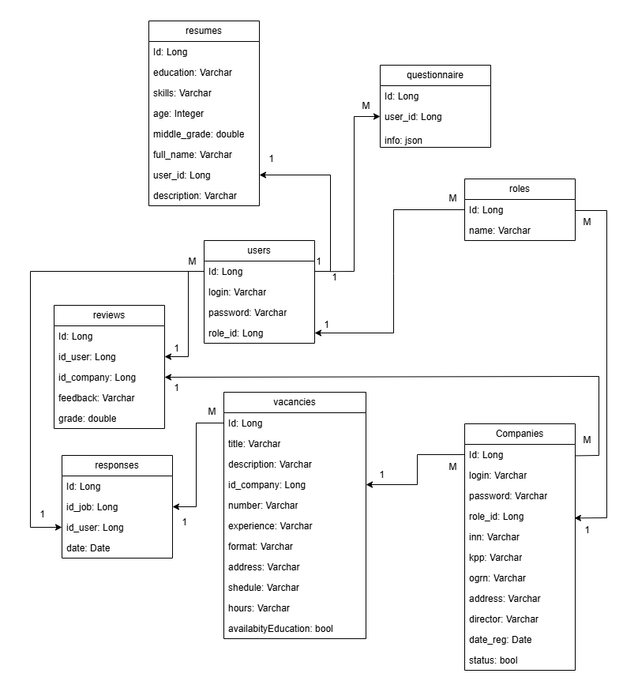
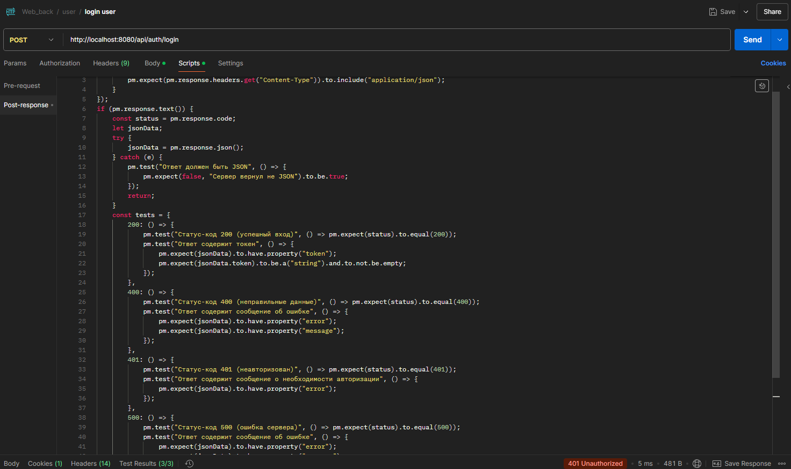
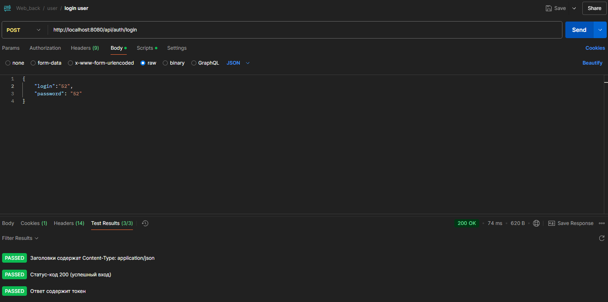

# Формулировка темы: система подбора вакансий для подростков

**Стейкхолдеры:** зарегистрированные компании (её представитель), подростки (соискатели), администраторы онлайн-сервиса.

## Функциональные требования к системе:  

**Компания:**  
• Размещает (публикует) вакансии.  
• Просматривает все свои объявления.     
• Редактирует информацию об объявлениях.  
• Закрывает неактуальные объявления.   
• Оставляет отзыв о работе соискателя.  
• Получает уведомления на почту об откликах в приложении.  

**Соискатель (подросток):**  
• Просматривает вакансии.  
• Откликается на интересующие его вакансии.  
• Оставляет отзыв о компаниях.  
• Заполняет анкеты и резюме.  

**Администратор системы:**  
• Имеет полный доступ ко всей информации и возможность её редактировать.  
• Добавляет организации, с которыми сотрудничает компания.

## Нефункциональные требования к системе:  
• Безопасность. Личная информация об аккаунтах пользователей системы должна храниться в зашифрованном виде.    
• Удобство использования. Интерфейс веб-сервиса должен быть интуитивно понятным после первых минут использования.  
• Производительность. Время отклика на запросы пользователей должно не превышать 2 секунд. Систему единовременно могут использовать до 50 пользователей.

## USE-CASE (диаграмма прецедентов)

## DDD (Domain Driven Design)

## ERD-диаграмма (схема бд)

## Выбранные инструменты:  
• IDE - Intellij IDEA 2024.3.2.1  
• Frameworks: Spring (Java), React (JS)      
• Линтер: checkstyle (для запуска пользовательского: "mvn checkstyle:checkstyle")    
## Выбранные модели данных:  
• На уровне приложения - классы-jpa (сущности бд)  
• На уровне хранения - реляционная база данных PostgreSQL 

## Код приложения:  
Ссылка на публичный репозиторий github c **частично-разработанным** REST API:  https://github.com/ieatprettygirl/HSE-back-End  (можно посмотреть реализованные модели (сущности), контроллеры, репозитории, фильтры, конфиг-файлы).  
Комментарий: Mock-тестирование не делал, все запросы тестировал скриптами в Postman.   
Пример:

