

# Практическая работа №3
## Моя распределенная система:

## Цель

Обеспечить быстродействие и надёжность Вашей распределённой системы.  

## Задачи

1. Настроить CI-процесс для Вашей распределённой системы. Туда должны входить:
- Проверка линтером.  
- Проверка статическим анализатором.
- Автоматическое тестирование (имеет смысл разделить на Unit -> Integration -> E2E).
2. Применить одну из техник для масштабирования компонентов Вашей распределённой системы:  
**ВЫБРАНО!** Балансировщик нагрузки L4 или L7 + репликация компонента. Необходимо выбрать алгоритм балансировки. Реплицировать компонент на уровне контейнеров (через оркестратор, например, docker compose).
3. Добавить централизованное логирование микросервисов через GrayLog.
4. Обновить или дописать необходимые тесты.

## Реализация

## 1 Часть

### CI-процесс (пайплайн в гх) выглядит следующим образом:

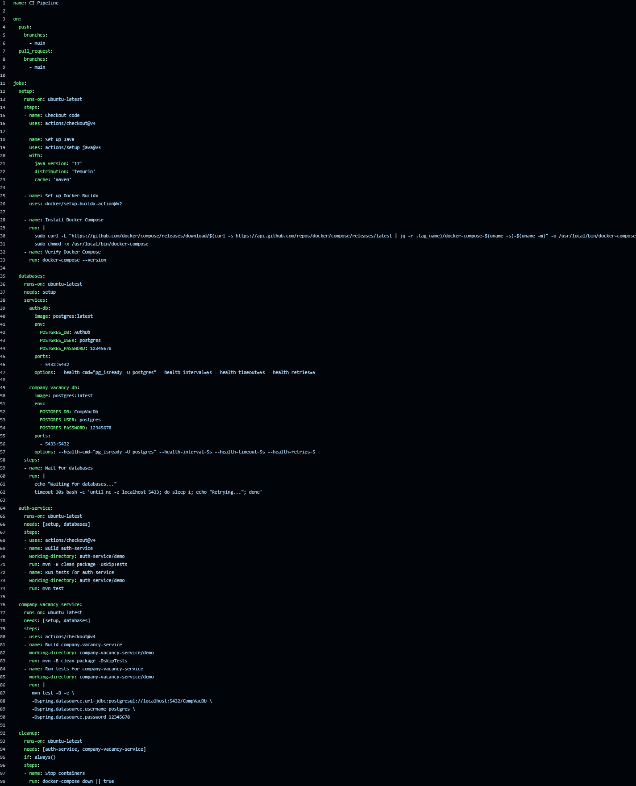

### Раздел "Actions":

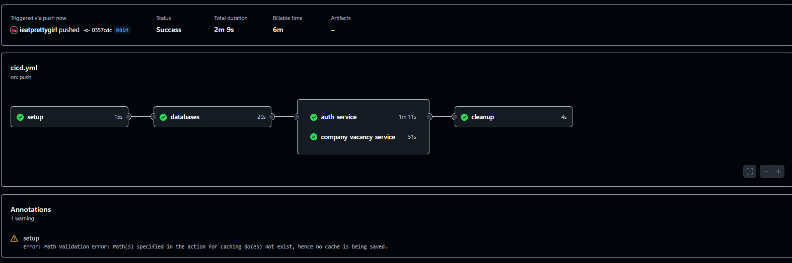

### ***На эти сотни попыток мы НЕ смотрим! :)***

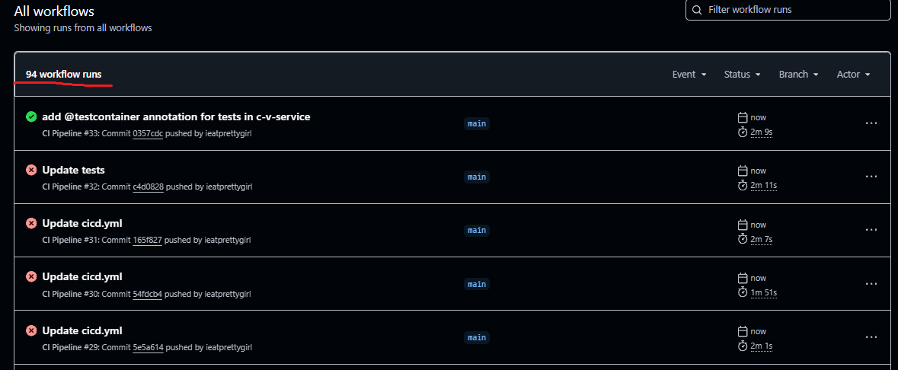

## 2 Часть

Был реализован балансировщик нагрузок Nginx (будет воротами к серверу, API-Gateway было решено убрать, поскольку излишне) и реплецированы 2 основных микросервиса:

### Config фаилы Nginx:

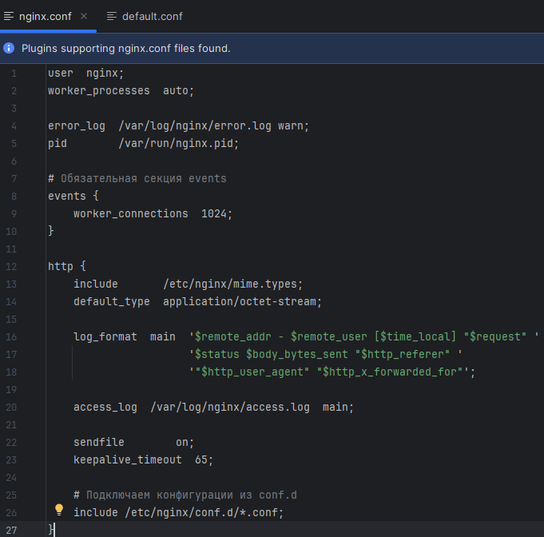

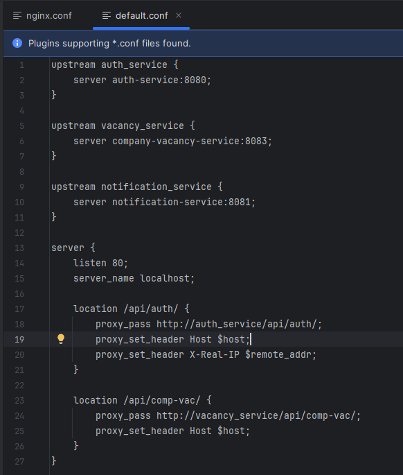

### Nginx в docker compose:

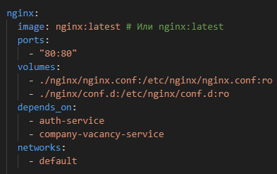

### Репликация 2-х микросервисов:

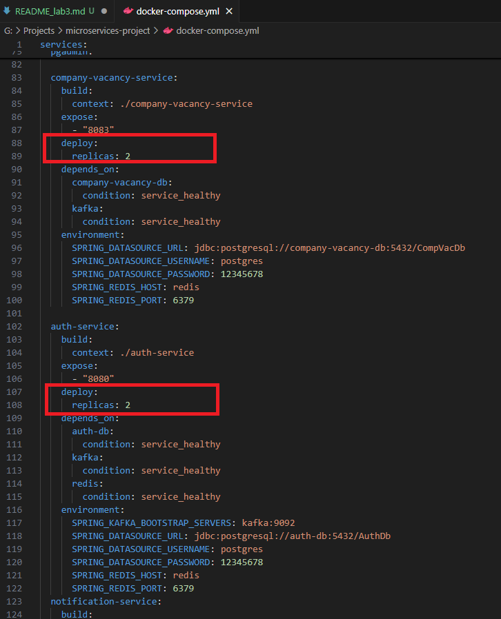

### Микросервисы (репликации) в docker compose:

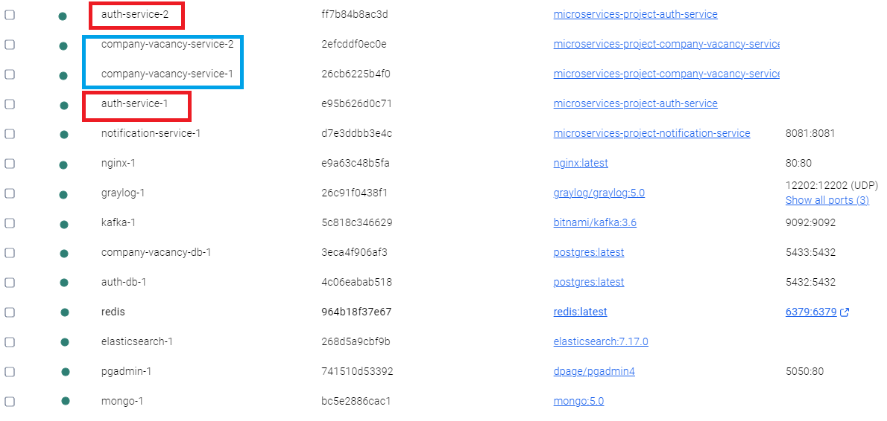

## 3 Часть

### GrayLog в docker compose:

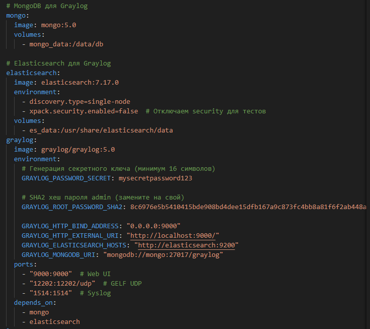

Также скриншотом выше он есть в активных контейнерах. Работоспособность централизованного логирования представлена на скриншотах наже (на примере добавления пользователя).

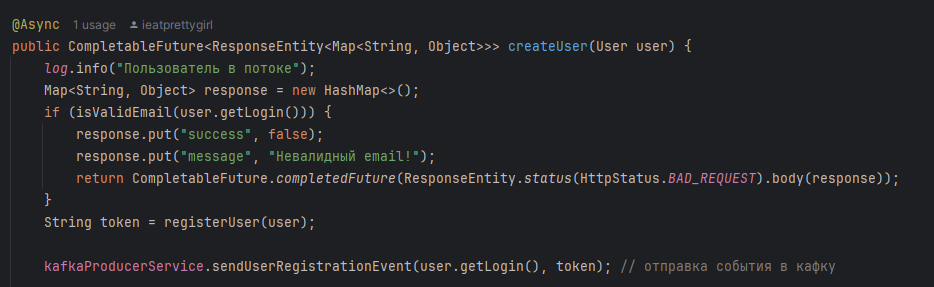

### Логи после отправки запроса через постман:

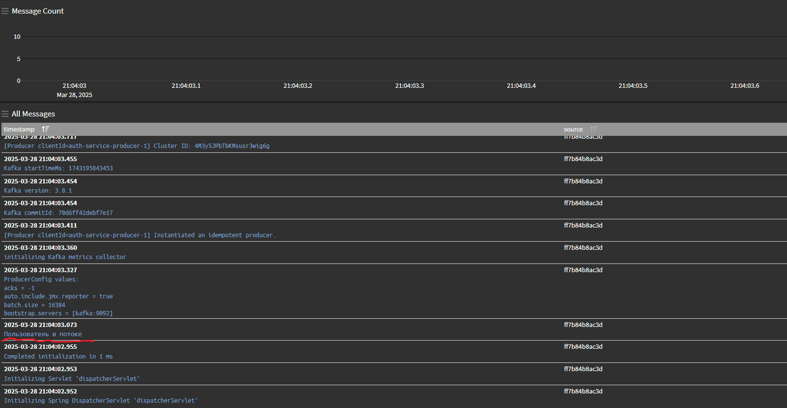

## 4 Часть

Тесты были обновлены и проверяются при каждом пуше\пулл реквесте в ветку main в CI.

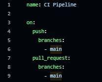