

# Практическая работа №1

## Цель

Применить async к Вашей DSS и подключить хранилище данных.

## Задачи

1. Подключить async-runtime к Вашей DSS.
2. Подключить выбранную СУБД к Вашей DSS (InMemoryUserRepository -> MySQLUserRepository).
3. Явно выделить слои Вашей DSS и отразить их в коде:
   1. Выбранный фреймворк (api endpoints, console app, etc.)
   2. Application (принимает и возвращает DTO)
   3. Domain (принимает Command, возвращает Event)*
   4. Infrastructure (реализация Repository, доступ к внешним сервисам, СУБД)
   5. Util (логирование и т.д.)**
4. Обновить или написать необходимые тесты.
5. Сформировать первичные Dockerfile и docker-compose Вашей DSS и её инфраструктуры (на основе шаблона).

## Реализация

БД: **PostreSQL**  
Количество реализованных сервисов: 3  

Были реализованы следующие эндпоинты (async) в сервисе "company-service":

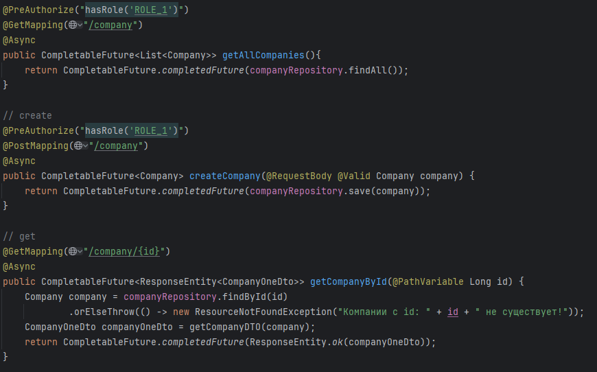

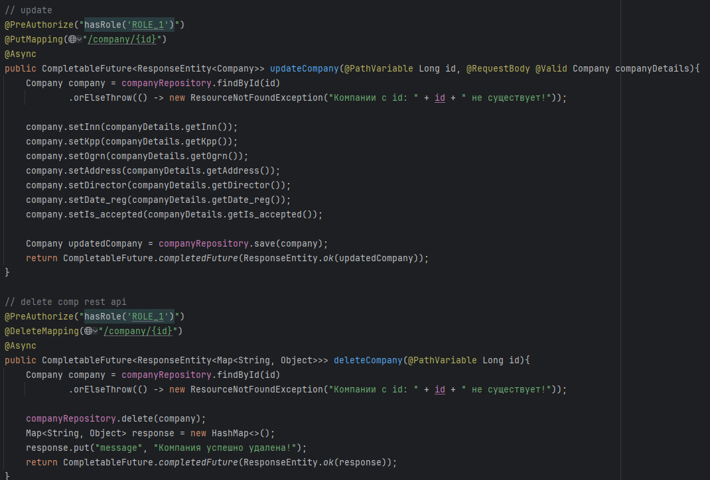

Был реализован эндпоинт (async) в сервисе "vacancy-service":

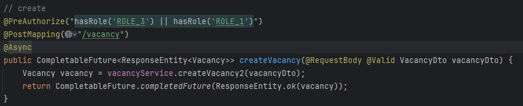

Были реализованы следующие эндпоинты (async) в сервисе "auth-service":

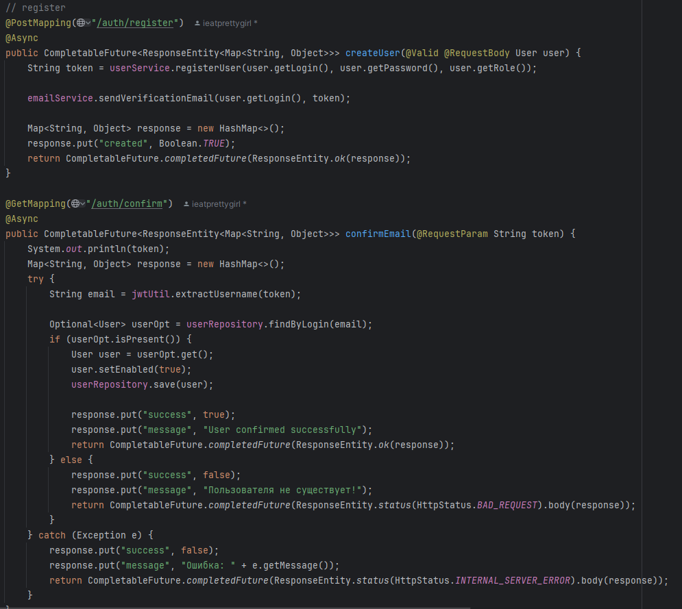

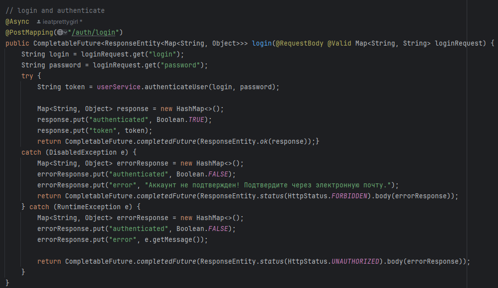

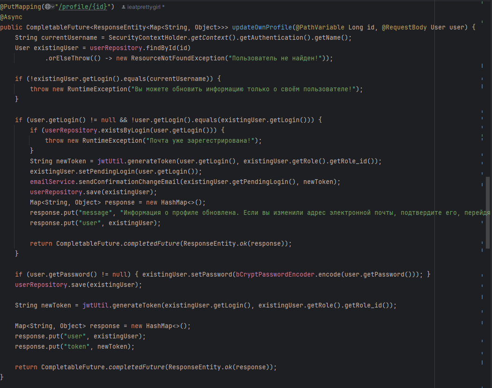

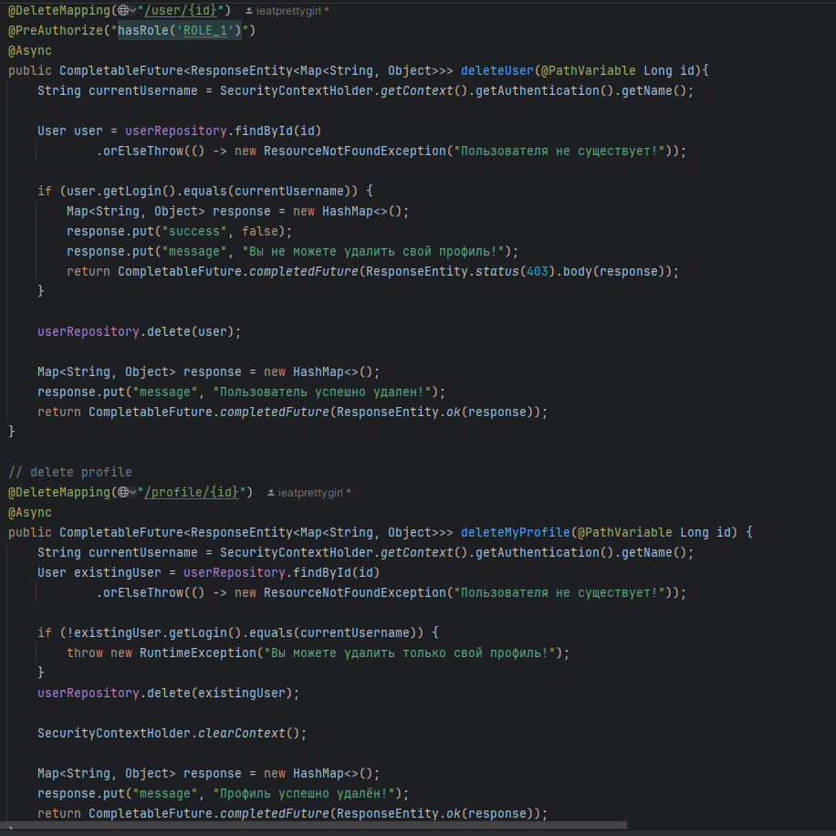

## Dokerfiles (в пример для 2 сервисов):

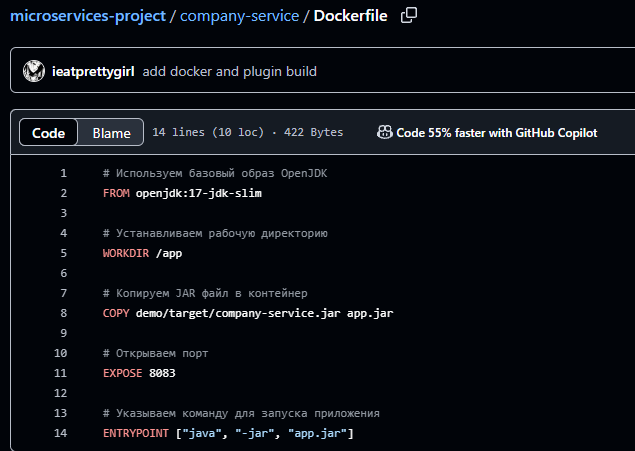

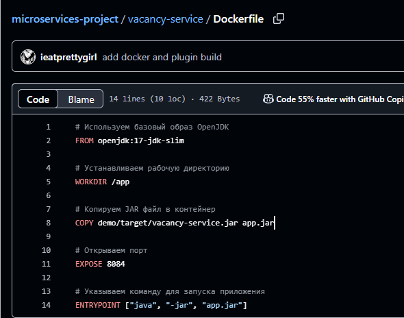

## Docker-compose:  
Комментарий: надо бы потом в secrets добавить, а не явно прописывать))))

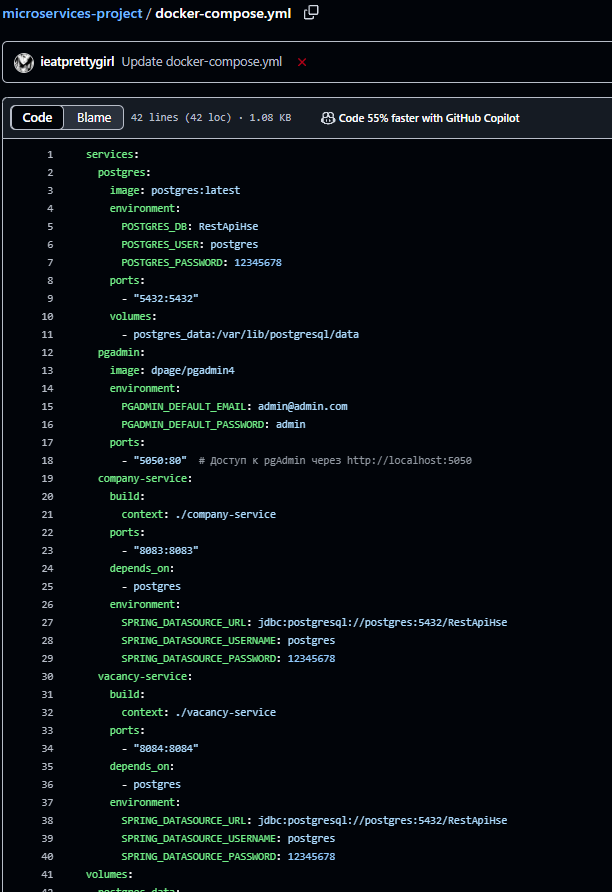

## built.bat (для локальной сборки):  

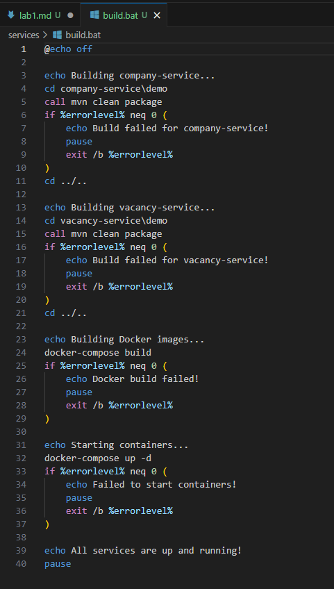

### Контейнеры:

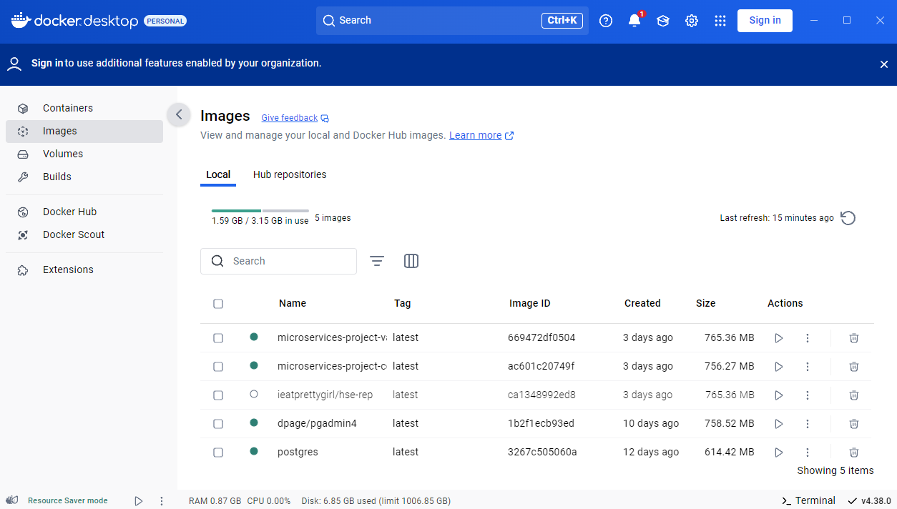
