

# Практическая работа №2

## Цель

Распилить Вашу DSS на сервисы.

## Задачи

1. Определить API Вашей DSS:
   1. Синхронный (RPC) или асинхронный (Event-based)? (Обосновать)
   2. Реализовать его с помощью выбранного фреймворка
2. Разделить Вашу систему на сервисы:
   1. Ограниченные контексты, выделенные в [П0](./practice0.md) - это буквально Ваши сервисы.
   2. Определить и реализовать интерфейсы сервисов (также как и для всей системы в п.1).
3. Обернуть сервисы в Dockerfile и обновить docker-compose.
4. Обновить или дописать необходимые тесты.
5. Подумать над выделением шаблонного репозитория.

## Реализация

Выбор асинхронной (Event-based) архитектуры для реализации **API DSS** обоснован высокой масштабируемостью и производительностью, что позволяет эффективно обрабатывать большое количество транзакций одновременно. Асинхронные системы обеспечивают устойчивость к сбоям, позволяя продолжать обработку событий даже при временной недоступности некоторых компонентов, что критично сказывает на работе системы целиком. Кроме того, легко интегрировать новые сервисы и технологии!

Систему успешно попилил.   
В качестве демонстрации представлено 3 сервиса: "auth-service", "company-vacancy-service" и "notification-service" (уведомляшки).  
Код каждого можно посмотреть в папке ***servicec***.

***Комментарий***: для каждого из сервисов (auth и company-vacancy) поднимается свой контейнер с БД. Также внутри auth-service реализована логика блэк-листа (redis), в который добавляются досрочно невалидные токены (к примеру при смене логина в системе). Также в роли продюссера выступает auth-service, который посылает обновление в брокер-сообщений (kafka), а консьюмер - notification-service, который слушает и отправляет уведомления на почту при успешной регистрации \ успешном изменении логина (email).   
**Скриншоты кода привёл ниже.**

### Кафка Producer

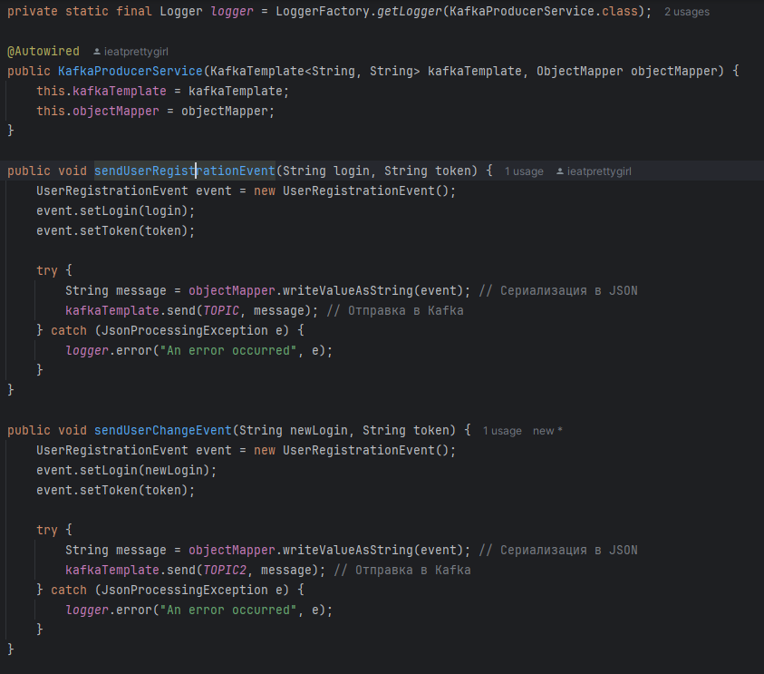

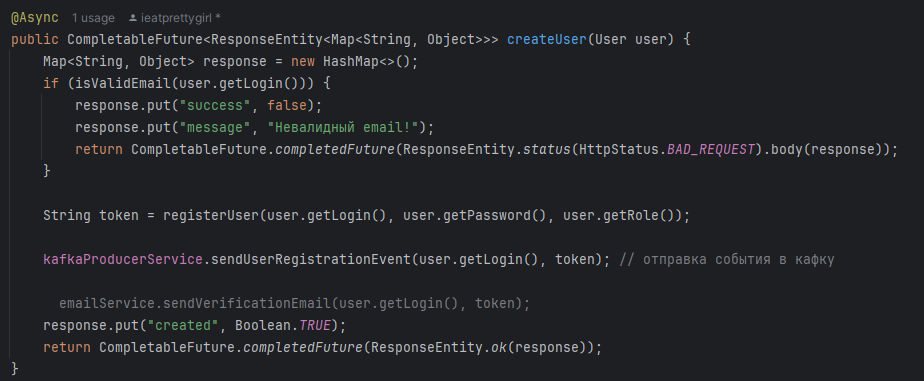

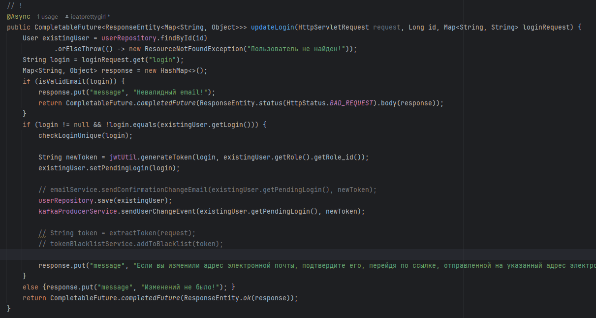

### Кафка Consumer

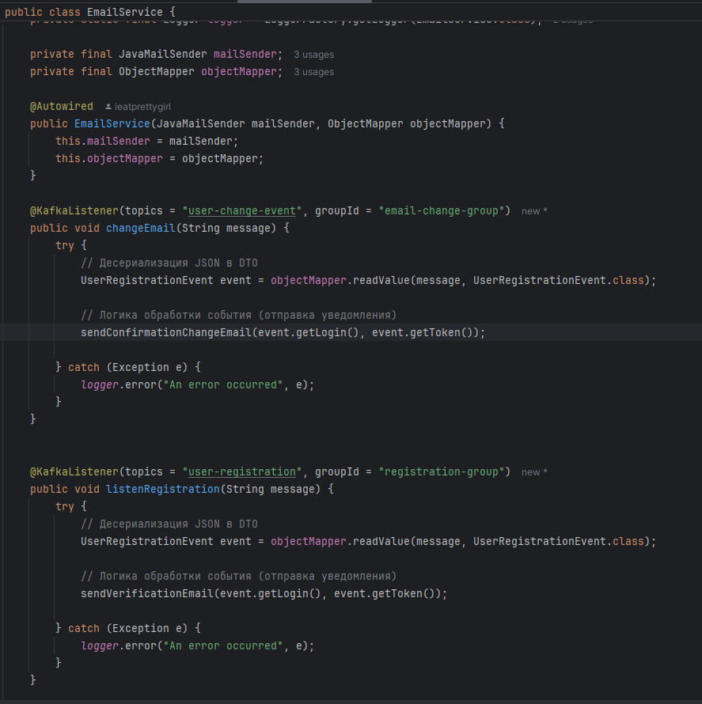

### DOCKER-File сервиса аутентификации:

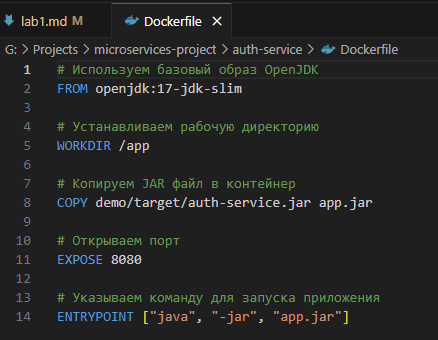

### DOCKER-File сервиса компаний и вакансий:

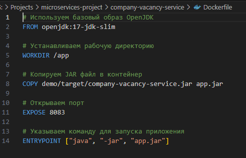

### DOCKER-File сервиса уведомлений:

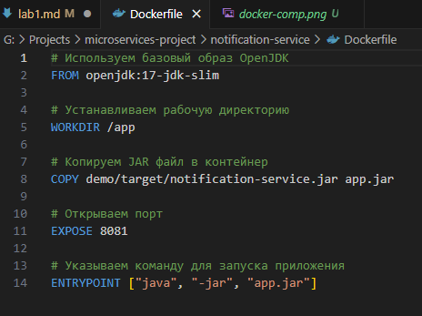

### Обновлённый DOCKER-COMPOSE (влез в 3 скрина...):

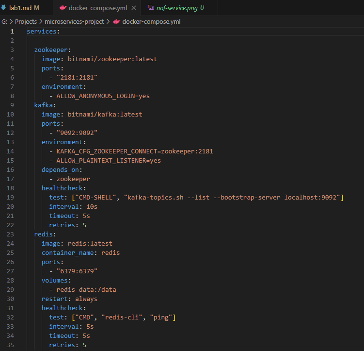

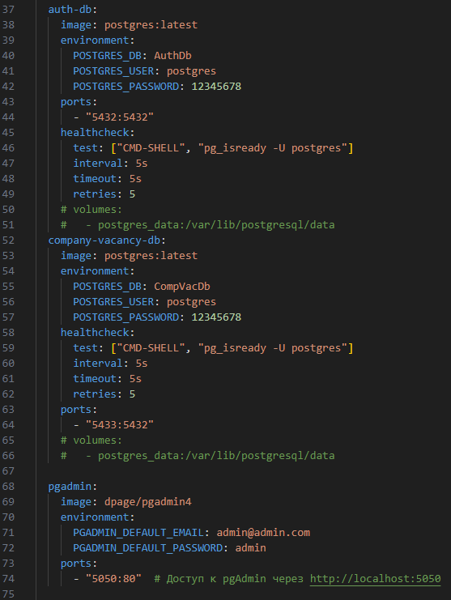

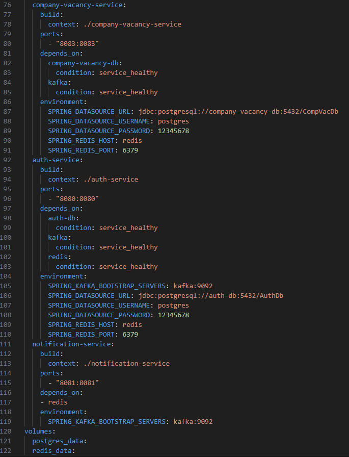

### Как выглядят контейнеры:

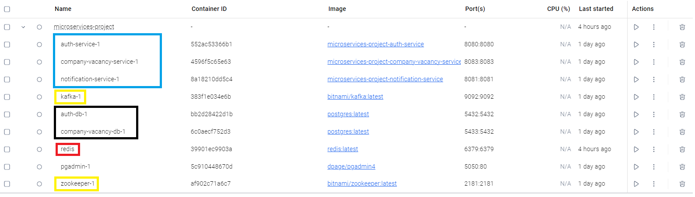

### В качестве выделенного репозитория используется JPA-репозиторий:

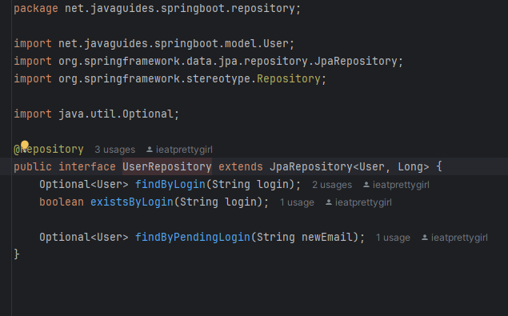

### Написаны mock-тесты, а также интеграционные тесты с использованием @Testcontainers, в котором поднимаются тестовая бд, кафка:

***Пример тестов*** (в разных сервисах, подробнее можно посмотреть в (имя сервиса)/dome/test/java/(имя класса)):

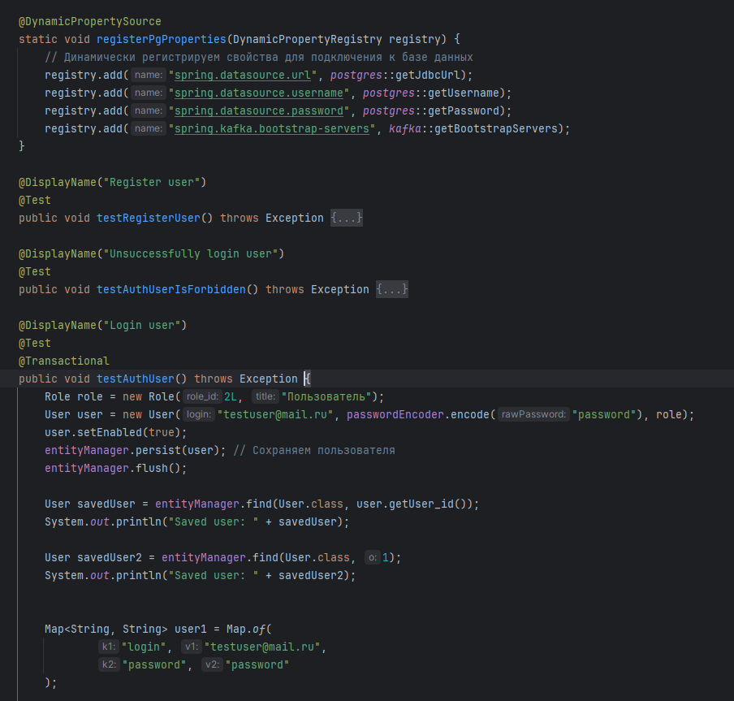

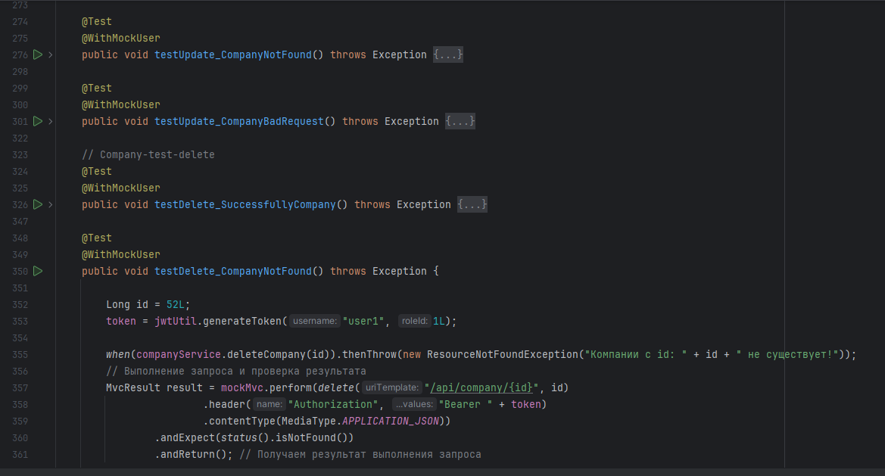
